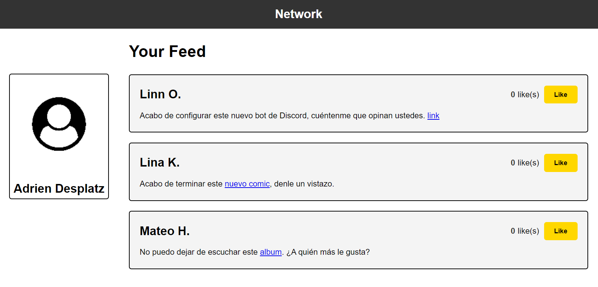
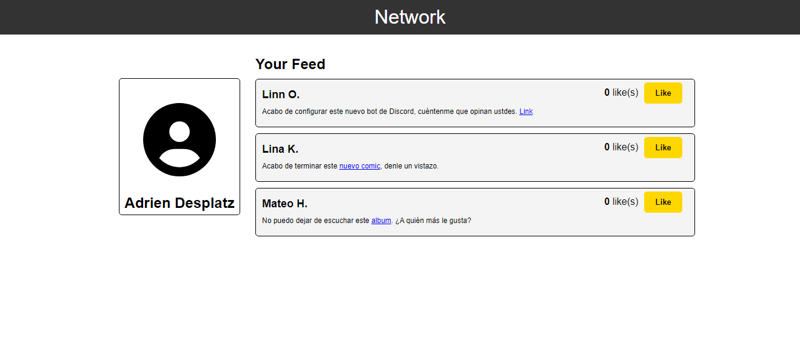

# Me Gusta

Este proyecto es una página web simple que simula una red social donde los usuarios pueden ver publicaciones y dar "me gusta" a las mismas. El código HTML proporciona la estructura básica de la página.

## Vista del Modelo

Aquí puedes ver la imagen del modelo que se utilizó como referencia:

## Vista Codificada

A continuación, se muestra la imagen del resultado codificado:

## Estructura del Proyecto

El proyecto se compone de las siguientes secciones:

- **Encabezado (`<header>`)**: Contiene el título principal de la página "Network".
- **Contenido Principal (`<main>`)**:
  - **Barra Lateral Izquierda (`<aside class="ladoIzquierdo">`)**: Muestra la información del perfil del usuario.
  - **Sección Principal (`<section class="ladoDerecho">`)**: Contiene las publicaciones de los usuarios con la funcionalidad de "me gusta".

## Tecnologías Utilizadas
- HTML5: Para la estructura del contenido.
- CSS3: Para el diseño y estilos de la página.
- JavaScript: Para la funcionalidad interactiva de la página.